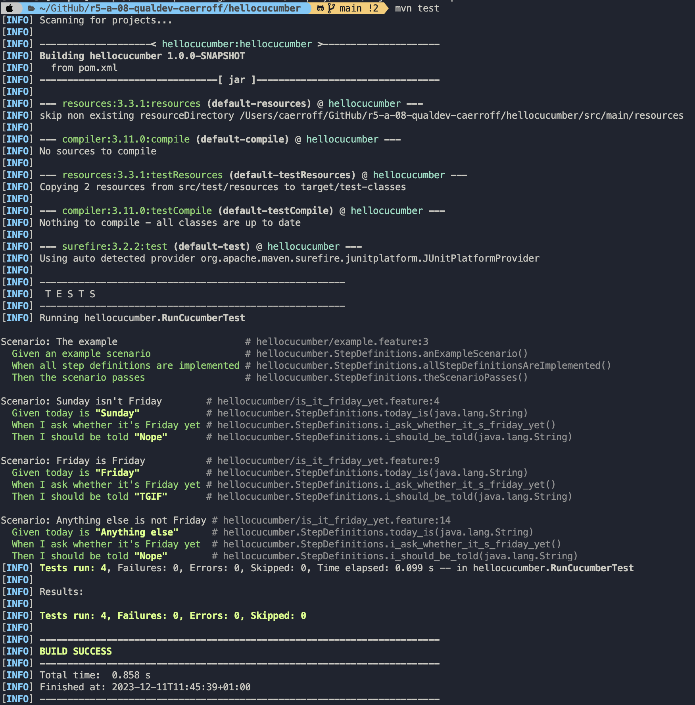
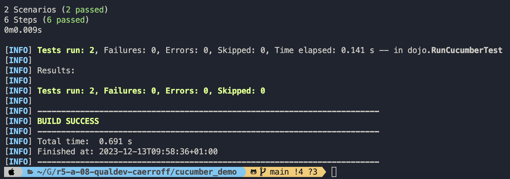

= R5.A.08 -- Dépôt pour les TPs
:icons: font
:MoSCoW: https://fr.wikipedia.org/wiki/M%C3%A9thode_MoSCoW[MoSCoW]

Ce dépôt concerne les rendus de mailto:A_changer@etu.univ-tlse2.fr[Jonh Doe].

== TP1

.is_it_friday_yet.feature

[source,text]
----
Feature: Is it Friday yet?
  Everybody wants to know when it's Friday

  Scenario: Sunday isn't Friday
    Given today is "Sunday"
    When I ask whether it's Friday yet
    Then I should be told "Nope"
    
  Scenario: Friday is Friday
    Given today is "Friday"
    When I ask whether it's Friday yet
    Then I should be told "TGIF"

  Scenario: Anything else is not Friday
    Given today is "Anything else"
    When I ask whether it's Friday yet
    Then I should be told "Nope"
----

.Exemple d'exécution réussie

== TP2
Mon fichier Order.java
----
package dojo;

import java.util.ArrayList;

public class Order {
    private String name;

    private String owner;

    private ArrayList<String> content;

    public Order() {
        this.name = "";
        this.content = new ArrayList<String>();
    }

    public Order(String name) {
        this.name = name;
        this.content = new ArrayList<String>();
    }

    public String getName() {
        return this.name;
    }

    public void setName(String name) {
        this.name = name;
    }

    public ArrayList<String> getContent() {
        return this.content;
    }

    public void declareOwner(String name) {
        this.owner = name;
    }

    public String getOwner() {
        return this.owner;
    }

    public void addCocktail(String name) {
        this.content.add(name);
    }
}

----

Et mes tests qui fonctionnent:

