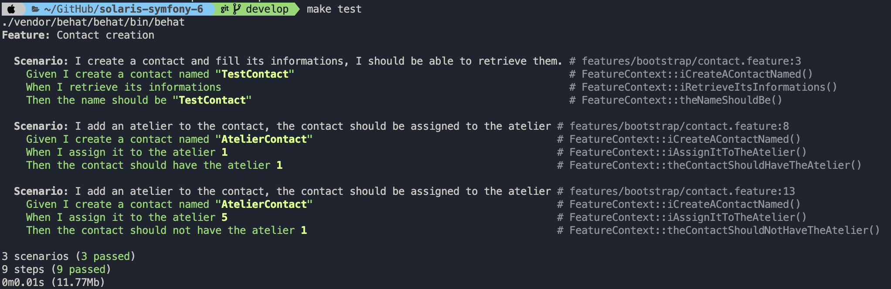

= R5.A.08 -- Dépôt pour les TPs
:icons: font
:MoSCoW: https://fr.wikipedia.org/wiki/M%C3%A9thode_MoSCoW[MoSCoW]

Ce dépôt concerne les rendus de mailto:A_changer@etu.univ-tlse2.fr[Jonh Doe].

== TP1

.is_it_friday_yet.feature

[source,text]
----
Feature: Is it Friday yet?
  Everybody wants to know when it's Friday

  Scenario: Sunday isn't Friday
    Given today is "Sunday"
    When I ask whether it's Friday yet
    Then I should be told "Nope"
    
  Scenario: Friday is Friday
    Given today is "Friday"
    When I ask whether it's Friday yet
    Then I should be told "TGIF"

  Scenario: Anything else is not Friday
    Given today is "Anything else"
    When I ask whether it's Friday yet
    Then I should be told "Nope"
----

.Exemple d'exécution réussie
image::tp1.png[width=80%]

== TP2
Mon fichier Order.java
----
package dojo;

import java.util.ArrayList;

public class Order {
    private String name;

    private String owner;

    private ArrayList<String> content;

    public Order() {
        this.name = "";
        this.content = new ArrayList<String>();
    }

    public Order(String name) {
        this.name = name;
        this.content = new ArrayList<String>();
    }

    public String getName() {
        return this.name;
    }

    public void setName(String name) {
        this.name = name;
    }

    public ArrayList<String> getContent() {
        return this.content;
    }

    public void declareOwner(String name) {
        this.owner = name;
    }

    public String getOwner() {
        return this.owner;
    }

    public void addCocktail(String name) {
        this.content.add(name);
    }
}

----

.Mes tests qui fonctionnent:
image::tp2.png[width=80%]

== TP3

Pour ce TP, j'ai décidé de faire des tests sur l'application que je développe en entreprise, une application de gestion de matériels, de personnel et de tickets.
L'application est écrite en Symfony (framework PHP) et possède beaucoup d'entités (objets) qui doivent être testés.
J'ai donc écris quelques tests pour une entité.

Voici mon fichier Feature : 
----
Feature: Contact creation

    Scenario: I create a contact and fill its informations, I should be able to retrieve them.
    Given I create a contact named "TestContact"
    When I retrieve its informations
    Then the name should be "TestContact"

    Scenario: I add an atelier to the contact, the contact should be assigned to the atelier
    Given I create a contact named "AtelierContact"
    When I assign it to the atelier 1
    Then the contact should have the atelier 1

    Scenario: I add an atelier to the contact, the contact should be assigned to the atelier
    Given I create a contact named "AtelierContact"
    When I assign it to the atelier 5
    Then the contact should not have the atelier 1
----

Les tests écris en PHP :
----
    /**
     * @Given I create a contact named :arg1
     */
    public function iCreateAContactNamed($arg1)
    {
        $this->contact = new Contacts();
        $this->contact->setNom($arg1);
    }

    /**
     * @When I retrieve its informations
     */
    public function iRetrieveItsInformations()
    {
        $this->informationRetrieved = $this->contact->getNom();
    }

    /**
     * @Then the name should be :arg1
     */
    public function theNameShouldBe($arg1)
    {
        assert($this->informationRetrieved == $arg1, new Exception('Les noms ne sont pas les mêmes'));
    }

    /**
     * @When I assign it to the atelier :arg1
     */
    public function iAssignItToTheAtelier($arg1)
    {
        $this->atelier = new Atelier();
        $this->atelier->setId($arg1);
        $this->contact->setAtelier($this->atelier);
    }

    /**
     * @Then the contact should have the atelier :arg1
     */
    public function theContactShouldHaveTheAtelier($arg1)
    {
        assert($this->contact->getAtelier()->getId() == $arg1);
    }

    /**
     * @Then the contact should not have the atelier :arg1
     */
    public function theContactShouldNotHaveTheAtelier($arg1)
    {
        assert($this->contact->getAtelier()->getId() != $arg1);
    }
----

.Mes tests qui passent:

